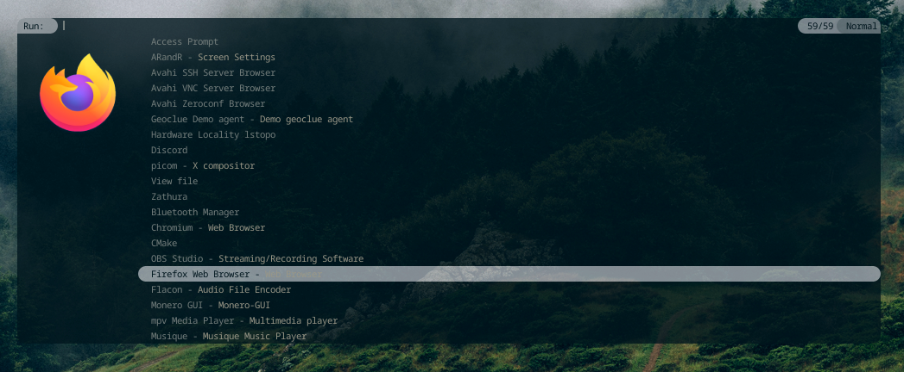
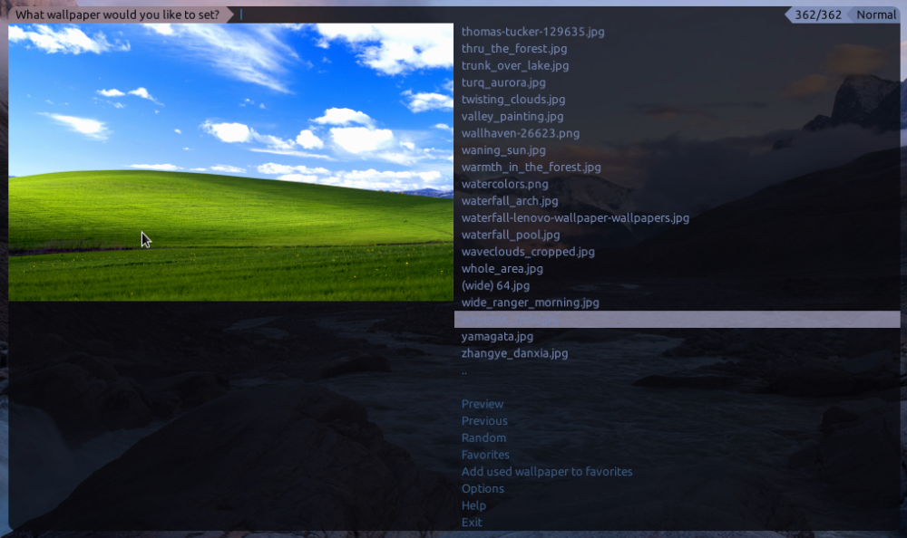
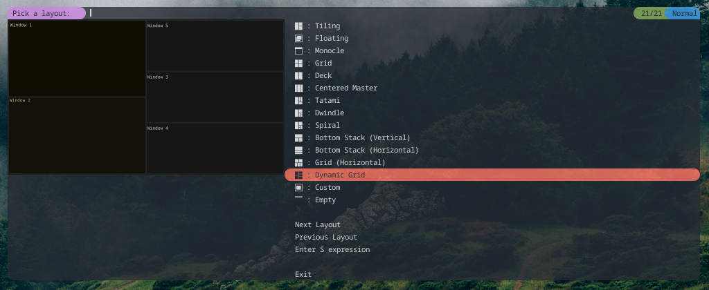
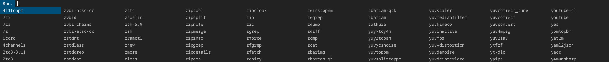

# spmenu

spmenu is an X11 and Wayland menu application which takes standard input, parses
it, lets the user choose an option and sends the selected option to standard output.

In addition to this, it also serves as a run launcher and desktop launcher
through the included shell script `spmenu_run`, which handles both $PATH
listing, .desktop entries, and file listing.

spmenu also serves as a proper dmenu replacement for Wayland users, and
can be themed to look identical to dmenu.

## Features

- X11 and Wayland support, most run launchers support only one
- Reading entries from standard input and file
- Image and icon support
- Run launcher, supporting both .desktop entries and $PATH
- fzf-like Fuzzy matching
- Vi-like modes
- History buffer
- Configuration file, allowing customizable keybinds
- Mouse binds
- XDG base directory compliant
- Theming
- Written in C
- ..and more

## Dependencies

- wayland-client
  - For Wayland support, which is optional.
- wayland-scanner
  - For Wayland support, which is optional.
- wayland-protocols
  - For Wayland support, which is optional.
- xkbcommon
  - For Wayland support, which is optional.
- libX11
  - For X11 support, which is optional.
- libXrender
  - For X11 support, which is optional.
- imlib2
  - Used for image support, can be disabled during compile time.
- libXinerama
  - For X11 support, which is optional.
  - Used for multi-monitor support, can be disabled during compile time.
- OpenSSL
  - Used to calculate MD5 of images if image support is enabled, can be
disabled during compile time.
- pango
- cairo
- libconfig
  - Can be disabled if you don't want/need config file support during compile time.
- meson
  - Used to compile spmenu, not optional unless you're experienced with build systems.

## Installation

- If you are on Arch GNU/Linux, you can add
[my repository](https://git.speedie.site/speedie/speedie-aur) which includes
`spmenu` as well as other useful packages. Then simply `pacman -S spmenu`.

- Or if you are on Gentoo GNU/Linux, you can add
[my overlay](https://git.speedie.site/speedie/speedie-overlay) which includes
`x11-misc/spmenu` as well as other useful packages. Then simply `emerge spmenu`.

If you still need/want to manually compile, follow along with manual compilation.

Here we're manually compiling spmenu. This is likely what you'll want to do
if you're using any distribution but Arch or Gentoo.

Git is required to clone the repository, but you can also use
[releases](https://ls.speedie.site). Those can be unpacked
using `tar -xpvf /path/to/spmenu-version.tar.gz`.

To install Git:

- Gentoo: `emerge dev-vcs/git`

- Arch: `pacman -S git`

- Debian: `apt-get install git`

You will also need the dependencies for spmenu. You'll
have to find those packages in your distribution repositories.

To clone the repository using Git:

`git clone https://git.speedie.site/speedie/spmenu`

`cd spmenu/`

Configure the build by running these commands:

`mkdir -p build/ # Create a build/ directory, Meson will use this as the working
directory`

`meson setup build # This will check to make sure all dependencies are found.
If you're recompiling you may want to pass --reconfigure as an argument`

This is where you can enable/disable certain features, as well as set
compiler options.

Now, to build it run `ninja -C build`. If all went well you should have a
binary in the `build/` directory.

Finally, to install it all, run:

`meson install -C build --prefix /usr # /usr may be overriden to /usr/local
or anything else`

To generate documentation, which may be necessary if you're pushing new changes
to your Git repository, run `scripts/spmenu_make docs` **in the current
directory**.

To generate a tarball, run `scripts/spmenu_make dist` **in the current
directory**. If you want to generate a pacman package, run
`scripts/spmenu_make pkg_arch` instead.

## Scripts

There's a page dedicated to user scripts
[over on the wiki](https://spmenu.speedie.site/User+scripts). Feel
free to contribute and try scripts on there.

## Simple mode

Some users may find the Vim modes confusing. If this is you, you
can copy [this file](https://git.speedie.site/speedie/spmenu-config/raw/branch/master/binds/simple-keybinds.conf)
to ~/.config/spmenu/binds.conf. This will restore some of
the more traditional dmenu keybinds. Do note that many
keybinds will be missing if you go for this, and keybinds
in spmenu.conf will be unused. One of the changes it makes
is removing normal mode, so insert mode will always be
used instead. Arrow keys are used for navigation
rather than Vim keys.

## Screenshots

## License

spmenu is licensed under the MIT license. See the included LICENSE file for
more information!

Before contributing, please see [this article](https://spmenu.speedie.site/Contributing+to+spmenu).

## Wiki

spmenu has [a wiki](https://spmenu.speedie.site) for more extensive
documentation. Contributions to the wiki are appreciated, and
can be done through [the Git repository](https://git.speedie.site/speedie/spmenu-wiki).
