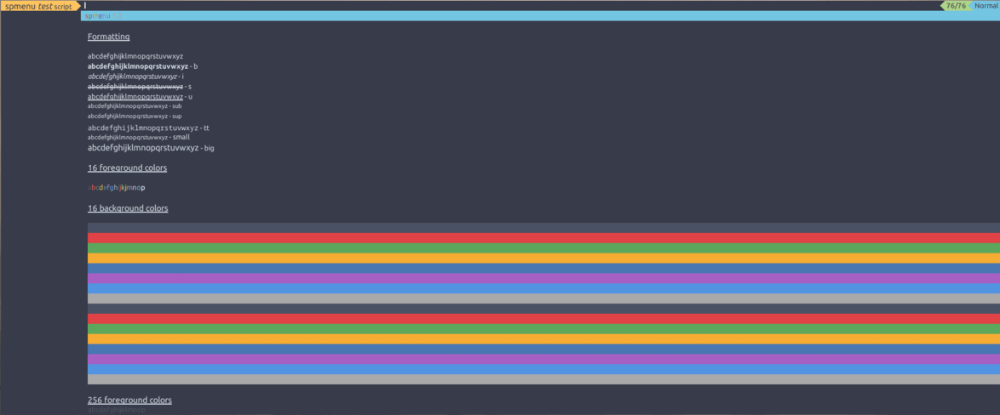

spmenu
======

spmenu is a simple X11 and Wayland menu application which takes standard input, parses
it, lets the user choose an option and sends the selected option to standard output.

In addition to this, it also serves as a run launcher and desktop launcher
through the included shell script `spmenu_run`, which handles both $PATH
listing, .desktop entries, and file listing.

While spmenu is based on dmenu, and is also fully compatible with dmenu,
spmenu introduces many new features which can be useful in shell scripting,
and notably Wayland support. There are way too many to list, but spmenu has a
[wiki](https://spmenu.speedie.site) which goes through features in more detail.

spmenu also serves as a proper dmenu replacement for Wayland users, and
can be themed to look identical to dmenu.

## Dependencies

- wayland-client
  - For Wayland support, which is optional.
- wayland-scanner
  - For Wayland support, which is optional.
- wayland-protocols
  - For Wayland support, which is optional.
- xkbcommon
  - For Wayland support, which is optional.
- libX11
  - For X11 support, which is optional.
- libXrender
  - For X11 support, which is optional.
- imlib2
  - Only a dependency if X11 support is enabled.
  - Used for image support, can be disabled during compile time.
- libXinerama
  - For X11 support, which is optional.
  - Used for multi-monitor support, can be disabled during compile time.
- OpenSSL
  - Used to calculate MD5 of images if image support is enabled, can be
disabled during compile time.
- pango
- cairo
- libconfig
  - Can be disabled if you don't want/need config file support during compile time.
- meson
  - Used to compile spmenu, not optional unless you're experienced with build systems.

## Installation

- If you are on Arch GNU/Linux, you can add
[my repository](https://git.speedie.site/speedie/speedie-repository) which includes
`spmenu` as well as other useful packages. Then simply `pacman -S spmenu`.

- Or if you are on Gentoo GNU/Linux, you can add
[my overlay](https://git.speedie.site/speedie/speedie-overlay) which includes
`x11-misc/spmenu` as well as other useful packages. Then simply `emerge spmenu`.

If you still need/want to manually compile, follow along with manual compilation.

Here we're manually compiling spmenu. This is likely what you'll want to do
if you're using any distribution but Arch or Gentoo.

Git is required to clone the repository, but you can also use
[releases](https://ls.speedie.site). Those can be unpacked
using `tar -xpvf /path/to/spmenu-version.tar.gz`.

To install Git:

- Gentoo: `emerge dev-vcs/git`

- Arch: `pacman -S git`

- Debian: `apt-get install git`

You will also need the dependencies for spmenu. You'll
have to find those packages in your distribution repositories.

To clone the repository using Git:

`git clone https://git.speedie.site/speedie/spmenu`

`cd spmenu/`

Configure the build by running these commands:

`mkdir -p build/ # Create a build/ directory, Meson will use this as the working
directory`

`meson setup build # This will check to make sure all dependencies are found.
If you're recompiling you may want to pass --reconfigure as an argument`

This is where you can enable/disable certain features, as well as set
compiler options.

Now, to build it run `ninja -C build`. If all went well you should have a
binary in the `build/` directory.

Finally, to install it all, run:

`meson install -C build --prefix /usr # /usr may be overriden to /usr/local
or anything else`

To generate documentation, which may be necessary if you're pushing new changes
to your Git repository, run `scripts/make/generate-docs.sh` **in the current
directory**.

To generate a tarball, run `scripts/make/generate-pkg.sh` **in the current
directory**. If you want to generate a pacman package, run
`scripts/make/generate-pacman-pkg.sh` instead.

## Wayland support

Note that Wayland support is still experimental, and some features do not
currently work under Wayland. Some will never work under Wayland due to limitations.
These are:

- Image support
  - Images simply will not be drawn on Wayland.
  - Will eventually be solved by replacing imlib2 with cairo.
- `--x-position` and `--y-position` arguments
  - These arguments do not work under Wayland, because the layer_shell
  protocol doesn't allow clients to be placed on a specific position.
- Embedding `-w` and window manager managed `-wm`
  - These arguments do not make much sense on Wayland, and embedding is not possible
  due to the original implementation using XEmbed. If the embed argument is passed
  it will simply be ignored and the window will be layered as normal.
- `--monitor` argument
  - Possible under Wayland, but not really useful.
- `--vertical-padding` and `--horizontal-padding` arguments
  - Not possible under Wayland due to layer_shell not supporting it.
- Window borders
- Pasting

## Scripts

There's a page dedicated to user scripts
[over on the wiki](https://spmenu.speedie.site/index.php/User+scripts). Feel
free to contribute and try scripts on there.

## More information

See the included spmenu(1) and spmenu_run(1) man pages.

## License

spmenu is licensed under the MIT license. See the included LICENSE file for
more information!

## Wiki

spmenu has [a wiki](https://spmenu.speedie.site) for more extensive
documentation. Contributions to the wiki are appreciated, and
can be done through [the Git repository](https://git.speedie.site/speedie/spmenu-wiki).
